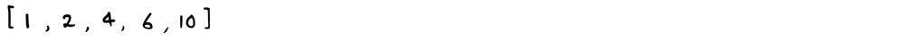
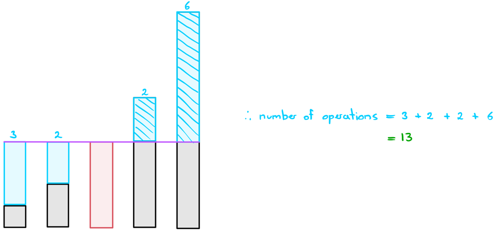

# Finding the Median to Minimize Operations

## Logic

Yes, this is a mathematics problem at its core. The basic idea here is that we can quite easily find the number of operations needed to perform if we know what the median of the array values is. Let's use the below example to detail this process:

### Example:

First, let's just try and understand why finding the median leads to the solution. The above example is conveniently sorted for us which allows us to observe the median more clearly:

Alright, our target is 4, which is our median. All we need to do now is find out how many operations are needed to change each number to 4 (keeping in mind that operations could include deletions as well):

And it looks like we've obtained the expected answer here.

## Why Did This Work?

There is a thorough mathematical proof to this, but I'll just try to explain this to you intuitively since you probably won't be able to spew out mathematical reasoning to this during an interview.

Let's first imagine we picked the smallest element as our target. What happens in this situation is we end up maximizing the number of operations needed to get the largest element down to the target. If the largest number is really large or there are a lot of larger numbers, then this can end up totaling to a lot of operations.

If we instead picked the largest element as our target, the same thing happens but for smaller elements. 

Therefore, intuitively, it's reasonable to suggest that if we picked the median element, we'll get the best of both worlds.

## Why Doesn't Taking the Mean Work?

This is mainly due to convergence. Taking a mean could put you in a situation where all the numbers would have to change when perhaps only a few of them do. 

The input `nums = [0,0,0,0,0,0,0,0,0,0,0,0,0,0,0,0,0,0,0,0,0,0,0,0,0,0,999999]` for example would have this issue.

The mean here is 37037. If this was our target, we would need 1,025,924 total operations.  
The median is 0. If this was our target, we would need 999,999 operations in total, which is less than the above.

## Finding the Median

There are a few ways to find the median. In this post, we'll go through the two main ways that you might be expected to bring up in an interview.

### Approach 1: Sorting the Array

This is fairly straightforward. If we simply sort the `nums` array, we can obtain the median by simply accessing the middle element. This allows us to find the median in **O(nlogn)** time. Keep in mind that if the array is of even length, we can just pick either of the two middle values as our median.

### Approach 2: Quick Select

The sorting method is inefficient because it sorts the entire array. All we really need to do is put the median element where it's supposed to be; we don't care about where the other elements end up. Sound familiar? Well, turns out we can do exactly that using **Quick Select**. In quick select, we'll just select the middle element; `n/2` and retrieve the value at that position. This allows us to find the median element in **O(n)** time on average.
